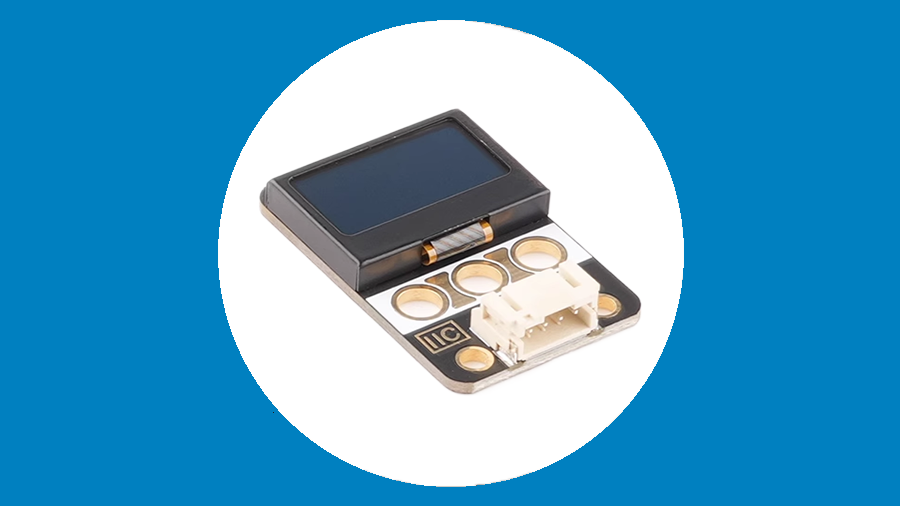
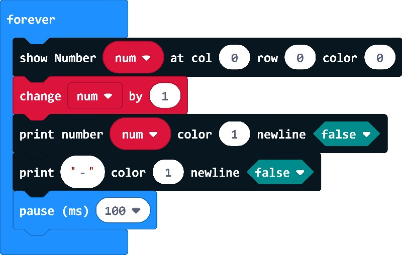

# YFROBOT OLED MakeCode Package 
This is the MakeCode Package for YFROBOT OLED controller, based on OLED driver [here](https://github.com/makecode-extensions/OLED12864_I2C_V2).


## Blocks
### Initialize YFROBOT OLED Display
Initializes the YFROBOT OLED display.

Sets up the YFROBOT OLED display and prepares it for use by the micro:bit.

https://github.com/YFROBOT-TM/pxt-yfrobot-oled2

makecode I2C OLED 128x64 extension V2 for micro:bit. with 6x8 font, and increased display speed.  


  

## Demo

```
let X = 0
basic.forever(function () {
    YFOLED2.printNumber(X, 1, false)
    YFOLED2.printString(", ", 1, false)
    basic.pause(500)
})
```



## License

MIT

Copyright (c) 2024, YFROBOT  


## Supported targets

* for PXT/microbit
  (The metadata above is needed for package search.)

